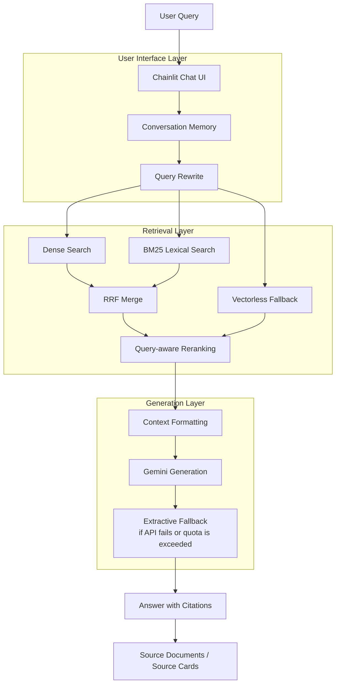

# Day08 — RAG Pipeline v2 Group Submission

Repository này là bài nộp nhóm cho **Day08 — RAG Pipeline v2**.

Repo được tổ chức theo dạng monorepo, gồm phần bài cá nhân của từng thành viên và phần group project của nhóm.

---

## Cấu Trúc Repository

```text
Day08_Lab-8_Team-066/
├── README.md
├── requirements.txt
├── .env.example
├── .gitignore
│
├── individual/
│   ├── 2A202600783_Thai-Thi-Yen-Nhi/
│   ├── 2A202601010_Tran-Quang-Huy/
│   └── 2A202601005_Dang-Huu-Nghia/
│
└── group_project/
    ├── README.md
    ├── chainlit_app.py
    ├── requirements.txt
    ├── .env.example
    ├── components/
    ├── rag/
    ├── src/
    ├── data/
    │   ├── standardized/
    │   └── index/
    ├── evaluation/
    │   ├── golden_dataset.json
    │   ├── eval_pipeline.py
    │   ├── ab_test.py
    │   ├── results.md
    │   └── ab_test_results.md
    ├── docs/
    │   ├── architecture.md
    │   ├── team_contribution.md
    │   └── dataset_inventory.json
    └── screenshots/
```

---

## Group Project

Sản phẩm nhóm là **LegalRAG Assistant** — web app hỗ trợ tra cứu thông tin pháp luật Việt Nam và tin tức liên quan đến ma túy.

Hệ thống có các chức năng chính:

- RAG chatbot tiếng Việt.
- Giao diện Chainlit giống chatbot.
- Truy xuất tài liệu bằng hybrid retrieval.
- Trả lời có citation.
- Hiển thị source documents đã dùng.
- Hỗ trợ follow-up questions bằng conversation memory nhẹ.
- Evaluation pipeline với golden dataset 15 câu hỏi.
- A/B testing giữa nhiều cấu hình retrieval.

---

## Kiến Trúc Hệ Thống



---

## Phân Công Công Việc

| Thành viên | MSSV | Nhiệm vụ | Trạng thái |
|---|---|---|---|
| Thái Thị Yến Nhi | 2A202600783 | Tổng hợp repo, backend integration, documentation, README, final cleanup | Hoàn thành |
| Trần Quang Huy | 2A202601010 | Chainlit UI, chatbot UX, source cards, retrieval settings, đóng góp dữ liệu | Hoàn thành |
| Đặng Hữu Nghĩa | 2A202601005 | Đóng góp dữ liệu, golden questions, evaluation validation, A/B testing | Hoàn thành |

---

## Hướng Dẫn Chạy

### Cài đặt dependencies

```bash
cd group_project
python -m venv .venv_chainlit
.venv_chainlit\Scripts\activate
python -m pip install -r requirements.txt
```

### Tạo file môi trường

Tạo file `.env` từ `.env.example` nếu muốn dùng Gemini:

```env
GEMINI_API_KEY=your_gemini_key
GEMINI_MODEL=gemini-2.5-flash-lite
PAGEINDEX_API_KEY=your_pageindex_key
```

Nếu không có Gemini key hoặc hết quota, app vẫn chạy bằng extractive fallback.

### Rebuild index

```bash
python -m src.build_index
```

Expected output:

```text
Documents: 16
Chunks: 550
```

### Chạy evaluation

```bash
python evaluation/eval_pipeline.py
python evaluation/ab_test.py
```

Kết quả được lưu tại:

```text
group_project/evaluation/results.md
group_project/evaluation/ab_test_results.md
```

### Chạy app

```bash
python -m chainlit run chainlit_app.py
```

Mở trình duyệt tại:

```text
http://localhost:8000
```

---

## Demo Questions

```text
Nghị định 28/2026 quy định gì về danh mục chất ma túy và tiền chất?
Bộ nào quản lý tiền chất sử dụng trong lĩnh vực công nghiệp?
Cơ sở cai nghiện bắt buộc được nhắc đến như thế nào?
Những nghệ sĩ nào trong dữ liệu liên quan tới ma túy?
Bài báo về Bình Gold nói gì về việc dương tính với ma túy?
Luật Phòng, chống ma túy 2021 quy định về nội dung gì?
```

---

## Evaluation Summary

Kết quả hiện tại:

| Metric | Score |
|---|---:|
| Context Recall | 1.000 |
| Context Precision | 0.308 |
| Faithfulness Proxy | 0.343 |
| Citation Coverage | 0.343 |
| Answer Relevance | 0.726 |

A/B testing:

| Config | Avg Context Recall |
|---|---:|
| Hybrid | 1.000 |
| Lexical | 1.000 |
| Vectorless | 0.933 |

Best config: **Hybrid retrieval**.

---

## Checklist Deliverables

- [x] Phần cá nhân của từng thành viên nằm trong `individual/`.
- [x] Group project nằm trong `group_project/`.
- [x] Web app Chainlit chạy được.
- [x] RAG chatbot trả lời tiếng Việt, có citation.
- [x] Source documents được hiển thị.
- [x] Golden dataset có 15 câu hỏi.
- [x] Evaluation pipeline chạy được.
- [x] A/B testing có báo cáo.
- [x] README mô tả kiến trúc và phân công.
- [x] Không commit `.env`, `.venv`, `__pycache__`, `*.pyc`.

---

## Ghi Chú

- Dataset group được curate từ đóng góp của cả 3 thành viên, không copy toàn bộ dữ liệu thô để tránh trùng lặp và nhiễu retrieval.
- Gemini API có thể bị giới hạn quota. Khi Gemini lỗi hoặc hết quota, hệ thống tự động dùng extractive fallback.
- Chi tiết dataset nằm trong `group_project/docs/dataset_inventory.json`.
- Chi tiết kiến trúc nằm trong `group_project/docs/architecture.md`.
- Chi tiết phân công nằm trong `group_project/docs/team_contribution.md`.
