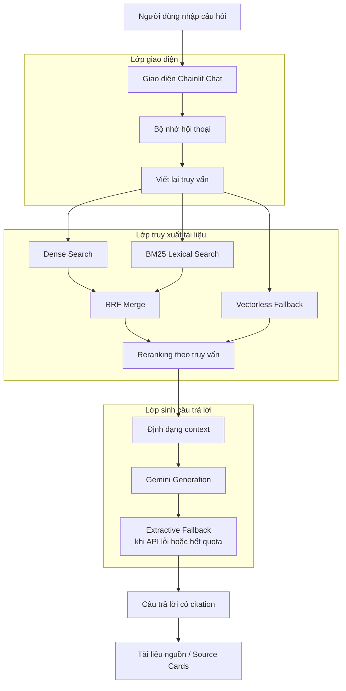
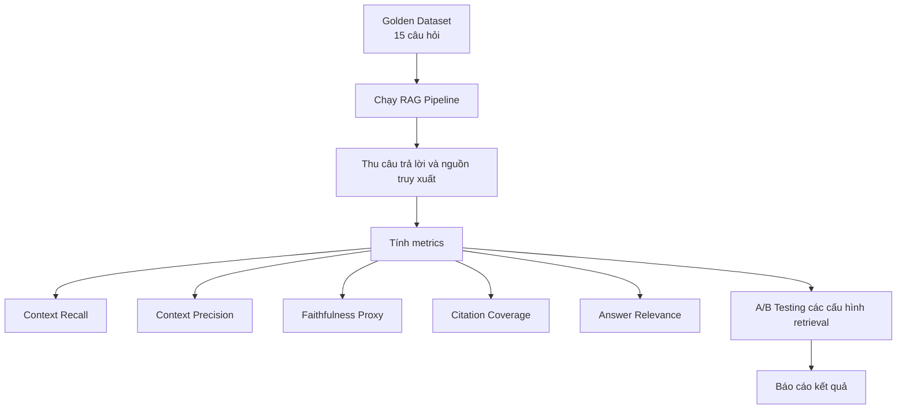

# Architecture

## System Overview

---

## Các Thành Phần Chính

| Thành phần | Mô tả |
|---|---|
| `chainlit_app.py` | Ứng dụng Chainlit chính dùng để demo chatbot. |
| `components/` | Các hàm hỗ trợ giao diện, đặc biệt là hiển thị source cards. |
| `rag/` | Các adapter kết nối Chainlit với retrieval/generation, memory, prompt và citation. |
| `src/build_index.py` | Build lại index chung từ các file markdown đã được curate. |
| `src/retrieval_pipeline.py` | Backend truy xuất tài liệu bằng dense search, BM25, RRF, reranking và fallback. |
| `src/generation.py` | Logic sinh câu trả lời có citation và extractive fallback. |
| `data/standardized/` | Bộ dữ liệu legal/news đã được lọc và chuẩn hóa từ đóng góp của các thành viên. |
| `data/index/` | Local JSON index và chunk embeddings. |
| `evaluation/` | Golden dataset, metrics, A/B testing và báo cáo kết quả. |

---

## Luồng Truy Xuất Và Trả Lời

1. Người dùng nhập câu hỏi tiếng Việt qua giao diện Chainlit.
2. Hệ thống dùng bộ nhớ hội thoại nhẹ để hỗ trợ follow-up questions.
3. Query có thể được viết lại để rõ ngữ cảnh hơn.
4. Retrieval pipeline tìm kiếm trong bộ tài liệu đã index bằng:
   - dense hashing search,
   - BM25 lexical search,
   - RRF merge,
   - query-aware reranking.
5. Nếu retrieval chính yếu hoặc không đủ tốt, hệ thống dùng vectorless/local fallback.
6. Các chunks được truy xuất sẽ được định dạng thành context.
7. Gemini được dùng khi có API key và còn quota.
8. Nếu Gemini lỗi hoặc hết quota, hệ thống chuyển sang extractive fallback.
9. Câu trả lời cuối cùng có citation và hiển thị source cards.

---

## Luồng Evaluation

---

## Metrics Đánh Giá

| Metric | Mục đích |
|---|---|
| Context Recall | Đánh giá retriever có tìm được evidence kỳ vọng hay không. |
| Context Precision | Đánh giá tỷ lệ context truy xuất thực sự hữu ích. |
| Faithfulness Proxy | Ước lượng mức độ câu trả lời bám vào nguồn truy xuất. |
| Citation Coverage | Đánh giá câu trả lời có gắn citation đầy đủ hay không. |
| Answer Relevance | Đánh giá câu trả lời có đúng trọng tâm câu hỏi hay không. |

---

## Thiết Lập A/B Testing

Evaluation pipeline so sánh nhiều cấu hình retrieval:

| Config | Mô tả |
|---|---|
| `A_hybrid` | Hybrid retrieval gồm dense search, BM25, RRF merge và reranking. |
| `B_lexical` | Baseline chỉ dùng BM25 / lexical retrieval. |
| `C_vectorless` | Baseline dùng vectorless/local fallback retrieval. |

Cấu hình tốt nhất hiện tại là **A_hybrid**.

---

## Ghi Chú

- App demo chính là `chainlit_app.py`.
- Dataset được curate thay vì gộp toàn bộ raw files để giảm trùng lặp và nhiễu retrieval.
- Gemini generation là tùy chọn. Khi Gemini API không khả dụng, app vẫn hoạt động bằng extractive fallback.